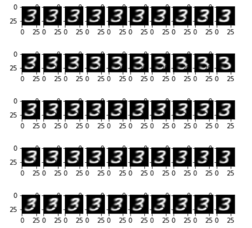
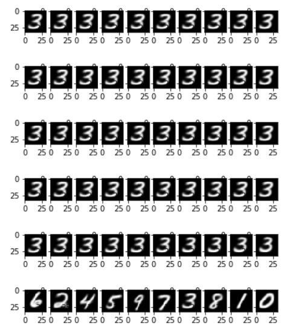

# ReadMe

## Reference

official_vae.py: https://github.com/Schlumberger/joint-vae (参考用)

architecture: https://github.com/FengHZ/mixupfamily

## Test Result

用原文章上的参数才能出结果,结构也必须一样。

而且我多训练了100个epoch才。。。。

